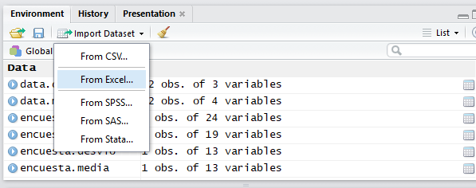

DataFrames en R 
========================================================
autosize: true
width: 1200
height: 800

<br />
Conociendo R
<br />
<br />
<br />
<br />
Juan Manuel Fernandez


Sobre la Herramienta
========================================================
R es un lenguaje de programación con un enfoque al análisis estadístico.

R es software libre y es uno de los lenguajes mas utilizados en investigación por la comunidad estadística y minería de datos.

<center>

</center>

Se distribuye bajo la licencia GNU GPL. Está disponible para los sistemas operativos Unix y GNU/Linux, Windows & Macintosh.
<br />
<br />
[1] https://www.r-project.org/
<br />
[2] https://www.rstudio.com/

Sobre los datos
========================================================
Un dataset consiste en una representación de un conjunto de hechos/individuos a través de un conjunto de características.

Para describir un dataset se analizan esas características (variables) y sus relaciones.

Las variables, a grandes rasgos pueden ser:
- Cualitativas/Discretas. 
- Cuantitativas/Continuas.

Es importante conocer los tipos de datos, dado que ello nos permite decidir que tipo de análisis utilizar.

Sobre el dataset para la demostración
========================================================
<small>
Iris: 150 instancias de flores de la planta iris en sus variedades:
- Setosa,
- Versicolor,
- Virginica.

Las caracteristicas son:

```r
data(iris)
names(iris)
```

```
[1] "Sepal.Length" "Sepal.Width"  "Petal.Length" "Petal.Width"  "Species"     
```
</small>

***
<center>

```r
pie(table(iris$Species), main="Cantidad por especie")
```


</center>
***


Empezamos: Cargando el dataset
========================================================
autosize: true
<small>
Podemos cargar el dataset de, al menos, dos maneras:
- Gráfica

<center>

</center>

***
- Por Código

```r
library(readr)
getwd()
```

```
[1] "C:/Users/unlu/Documents/GitHub/dm-uba/2021/laboratorios/LAB01/presentacion"
```

```r
# con setwd() seteo el directorio
```


```r
iris <- read_csv("/home/juan/data/iris.csv")
```
</small>
***
Los datasets serán contenidos en un dato de tipo Data.Frame...

Nuestro Tipo de dato estrella: el Data.Frame
========================================================
autosize: true
<small>
El dataframe es una estructura de datos similar a la matriz, a diferencia que puede tener columnas con diferentes tipos de datos:

```r
str(iris)
```

```
'data.frame':	150 obs. of  5 variables:
 $ Sepal.Length: num  5.1 4.9 4.7 4.6 5 5.4 4.6 5 4.4 4.9 ...
 $ Sepal.Width : num  3.5 3 3.2 3.1 3.6 3.9 3.4 3.4 2.9 3.1 ...
 $ Petal.Length: num  1.4 1.4 1.3 1.5 1.4 1.7 1.4 1.5 1.4 1.5 ...
 $ Petal.Width : num  0.2 0.2 0.2 0.2 0.2 0.4 0.3 0.2 0.2 0.1 ...
 $ Species     : Factor w/ 3 levels "setosa","versicolor",..: 1 1 1 1 1 1 1 1 1 1 ...
```
Es la estructura de datos mas utilizada por su versatilidad y potencia. Podemos cargar datasets a partir de distintos tipos de archivos o podemos crearlas a partir de la conjunción de listas/arrays con la función data.frame().
</small>

el Data.Frame - Accediendo a los datos
========================================================
autosize:true
<small>
Accedemos por Atributo/Columna:

```r
iris$Sepal.Length[1:5]
```

```
[1] 5.1 4.9 4.7 4.6 5.0
```

```r
iris[1:5,1]
```

```
[1] 5.1 4.9 4.7 4.6 5.0
```
Accedemos por Instancia/Fila:

```r
iris[3,1:3]
```

```
  Sepal.Length Sepal.Width Petal.Length
3          4.7         3.2          1.3
```

```r
iris[2,-c(4,5)]
```

```
  Sepal.Length Sepal.Width Petal.Length
2          4.9           3          1.4
```
***
Seleccionamos Instancias que cumplen una condición:


```r
iris[iris$Species=="setosa" & iris$Sepal.Length>5.2,3:4]
```

```
   Petal.Length Petal.Width
6           1.7         0.4
11          1.5         0.2
15          1.2         0.2
16          1.5         0.4
17          1.3         0.4
19          1.7         0.3
21          1.7         0.2
32          1.5         0.4
34          1.4         0.2
37          1.3         0.2
49          1.5         0.2
```
</small>

Actualizando el Data.Frame (ABM)
========================================================
autosize:true
<small>
Podemos AGREGAR una instancia o un conjunto de instancias:

```r
nuevas.filas<-data.frame(Sepal.Length=5, Sepal.Width=5, Petal.Length=5, Petal.Width=5, Species="Data Mining")
iris<-rbind(iris, nuevas.filas)
```
Podemos MODIFICAR una instancia o un conjunto de instancias:


```r
iris[1,1:4]=c(4.4,4.4,4.4,4.4)
```

```r
iris[iris$Species=="setosa",1:4]=iris[iris$Species=="setosa",1:4]*5
```
Podemos ELIMINAR una instancia o un conjunto de instancias:

```r
iris<-iris[-c(1:5),]
```
</small>
