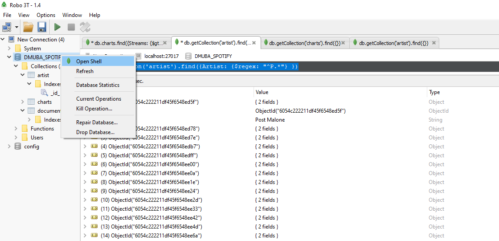

# Guía de Laboratorio: Introducción a Bases de Datos NOSQL

En esta guía vamos a presentar las acciones básicas con una Base de Datos MongoDB, iniciando con la creación de una base de datos, con sus respectivas colecciones y avanzando luego con las operaciones CRUD (create, read, update y delete).

## Creación de "esquemas" con MongoDB con Robo3T

A continuación se presentan la forma de crear Bases de datos ycolecciones en una Bases de Datos con MongoDB a través de la interfaz Robo3T.

### Crear una db. 
Con botón derecho sobre la conexión, __Create Database__


### Crear una colección
Botón derecho sobre *collections* __Create Collection__


## OPERACIONES CRUD

Como vimos en la teoría, las operaciones de creación, actualización, borrado y consulta de datos son denominadas CRUD (create, read, update, delete) y son similares a las que estamos acostumbrados en los Sistemas Gestores de Bases de Datos tradicionales.

Ejemplo: cómo armar un documento JSON para importar a la base.

```javascript
    { 
        "_id": 1,
        "titulo": "Se estrelló un avión en Cuba",
        "cuerpo": "La aeronave cayó a poco de despegar del aeropuerto de La Habana. Era un Boeing 737 de una compañía aérea subsidiaria de Cubana de Aviación. El presidente cubano Miguel Díaz-Canel se dirigió de inmediato al lugar del accidente.",
        "fecha-hora": "2018-05-18 16:00:00"
    }
```
Una forma práctica de ejecutar comandos sobre una Base de Datos MongoDB es a través del Shell de Robo3T. Para abrir el Shell apuntando a una DB determinada, tenemos que hacer click derecho sobre la misma y presionar en __"Open Shell"__:



Una vez ahí, podemos ejecutar todas las operaciones CRUD:

a) Incorporar un documento a la colección __documentos__ desde el shell (Si la colección no existe, la crea):

```javascript
    db.documentos.insertOne({ 
        "_id": 1,
        "titulo": "Se estrelló un avión en Cuba",
        "cuerpo": "La aeronave cayó a poco de despegar del aeropuerto de La Habana. Era un Boeing 737 de una compañía aérea subsidiaria de Cubana de Aviación. El presidente cubano Miguel Díaz-Canel se dirigió de inmediato al lugar del accidente.",
        "fecha-hora": "2018-05-18 16:00:00"
    })
```    

b) Buscar todos los documentos cargados en la colección __documentos__:
```javascript
    db.documentos.find({})
```

c) Actualizar un atributo con __update__:

```javascript
    db.documentos.update(
        {"_id": 1},
        {$set: {"titulo": "NOTICIA MODIFICADA EN UNLu"}}
    )
```

d) Eliminar un documento de la colección por su id:

```javascript
    db.documentos.deleteOne({"_id": 3})
```
    
e) Incorporar varios documentos a través del shell:

Con la instrucción db.<mi colección>.insert([{doc1}, {doc2}, ...,])

Ejemplo:

```javascript
    db.documentos.insert([       
    {   "_id": 2,
        "titulo": "Esta es la noticia 2.",
        "cuerpo": "Este es el cuerpo de la noticia 2.",
        "fecha-hora": "2018-05-18 16:00:00"
    },
    {   "_id": 3,
        "titulo": "Esta es la noticia 3.",
        "cuerpo": "Este es el cuerpo de la noticia 3.",
        "fecha-hora": "2018-05-18 16:00:00"
    }    
    ])
    
```

### Consultas básicas

d) Utilizar operadores de comparación (Ejemplos sobre colecciones de Spotify)

¿Cuantos tracks de la colección charts tienen más de un 10.000.000 de streams?

```javascript

db.charts.find({Streams: {$gt: 10000000} })

```
Además, podemos consultar otros operadores de MongoDB [aquí](https://docs.mongodb.com/manual/reference/operator/query-comparison/)

e) Utilizar búsquedas por cadenas

¿Qué artistas comienzan con P?

```javascript

db.getCollection('artist').find({Artist: {$regex: "^P.*"} })

```
